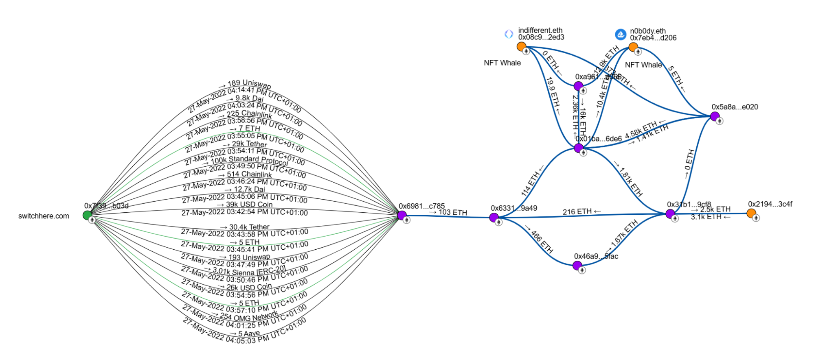

# Crypto Report #0134 Stolen 100 ETHs Leads to NFT Whales n0b0dy and indifferentguy (25mln$ worth) and a real company undeads.com (6mln$ investments and 50mln$ coin cap) 

## Keywords

crypto theft, [switchere.com](http://switchere.com), indifferent.eth, indifferentguy.eth, n0b0dy.eth, kfox.eth, undeads.eth, [undeads.com](http://undeads.com), Sezual PTE. LTD., Undeads Interactive Limited, crypto report, crypto investigation

## Related investigations

A crypto detective named [@cryptokarl013](https://cryptokarl013.github.io) started a major investigation after a small theft of 100 ETH from [switchere.com](http://switchere.com). This led him to find relation that two big NFT whales, **n0b0dy** and **indifferentguy**, who are worth about $25 million and are well-known influencers, were connected to a real company called [undeads.com](http://undeads.com). That company has raised $6 million and its coin, **$UDS**, is worth about $50 million in July 2025.

The following is a series of smaller investigations that led to these significant conclusions:
  * [Report #0134.0 Crypto theft from switchere.com connected with NFT Whales n0b0dy.eth and indifferent.eth](report-0134.0-crypto-theft-from-switchere.com-connected-with-nft-whales-n0b0dy.eth-and-indifferent.eth)
  * [Report #0134.1 NFT Whales n0b0dy.eth and indifferent.eth invest into undeads.com and attempt to hide it](report-0134.1-n0b0dy.eth-and-indifferent.eth-invest-in-undeads.com-and-attempt-to-hide-it)
  * [Report #0134.2 Undeads.com hides legal entity information](report-0134.2-undeadscom-lacks-clear-official-legal-entity-information)
  * [Report #0134.3 40% of $UDS coin unlocked marked cap (>40mln$ in August 2025) connected with indifferentguy and n0b0dy NFT whales](report-0134.3-40-percent-of-$UDS-coin-unlocked-marked-cap-connected-with-indifferentguy-and-n0b0dy-NFT-whales)

## Abstract
In May 2022, over 100 ETH were stolen from a hot wallet of the [switchere.com](http://switchere.com) crypto exchange. 

By 2025, these stolen funds were traced to NFT whales __Indifferent.eth__ and __N0b0dy.eth__, who hold assets worth over $25 million.

## Conclusions
* **n0b0dy.eth** and **indifferent.eth** are connected with crypto thefts including the [switchere.com case](report-0134.0-crypto-theft-from-switchere.com-connected-with-nft-whales-n0b0dy.eth-and-indifferent.eth)

* **n0b0dy.eth** and **indifferent.eth** are managed by a single person or a coordinated group

* [Undeads.com](http://undeads.com), a legitimate company received more than **$2 million** in investments from **indifferent.eth** and **N0b0dy.eth** in pre-seed and seed rounds.

* [Undeads.com](http://undeads.com) has been funded with illicit money provided by investors **n0b0dy.eth** and **indifferent.eth**.

* **nobody.eth** and **indifferent.eth** are either the founders of Undeads.com or are closely connected with them. (_Investors put millions into a company only when they have strong confidence in its founders. The pre-seed and seed funding rounds only included two investors: Nobody.eth and Indifferent.eth._)

* **n0b0dy.eth** tries to hide the information about funding into [Undeads.com](http://undeads.com)

* **undeads.com** hides official company information intentionally (_unclear legal jurisdiction, no public accounts of C-Level, empty LinkedIn in profiles__). 

* In August 2025, over $40 million of the unlocked market capitalization for the __$UDS__ coin is tied to two NFT whale investors, **indifferentguy** and **n0b0dy**. This represents $40%$ of the total unlocked supply.

## Breadcrumb reports
[https://www.breadcrumbs.app/reports/17067?share=df899b2c-9c8a-4ee2-9120-17c8c430c85c](https://www.breadcrumbs.app/reports/17067?share=df899b2c-9c8a-4ee2-9120-17c8c430c85c) 

> [!IMPORTANT]
> For any further clarification regarding the current investigation, please contact [@cryptokarl013](https://cryptokarl013.github.com#contacts). Any assistance that helps enrich the investigation would be greatly appreciated.\
> The report's content is based on verifiable public information.

## Images
[All images and screenshots](https://cryptokarl013.github.io/report-0134-stolen-ETHs-Leads-to-NFT-Whales-n0b0dy-indifferent-and-investments-into-a-real-company-undeadscom/images)

