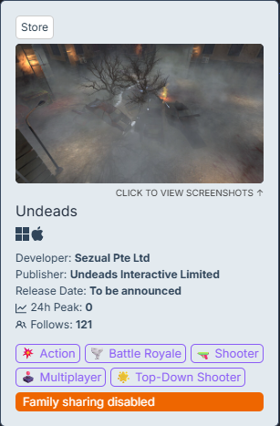
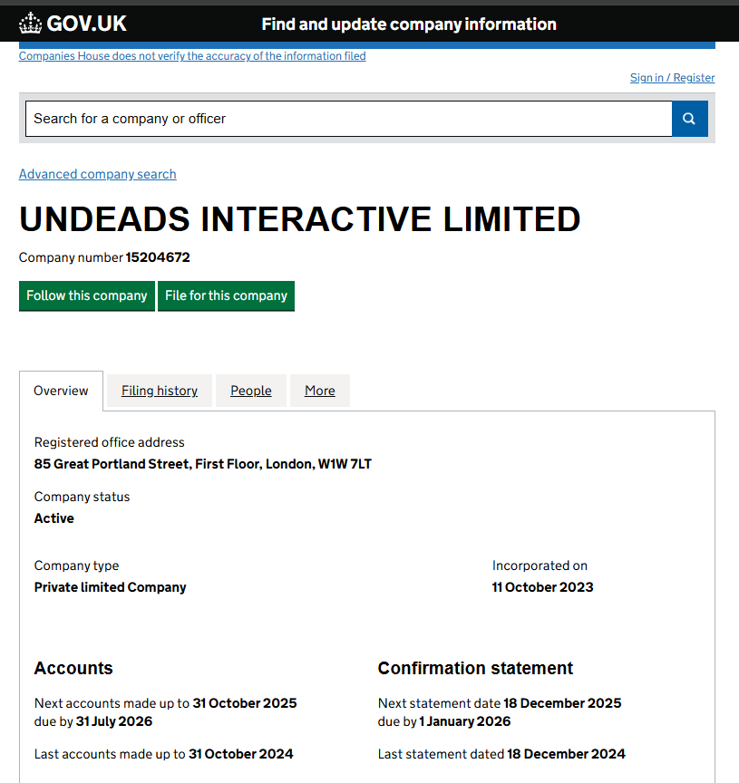
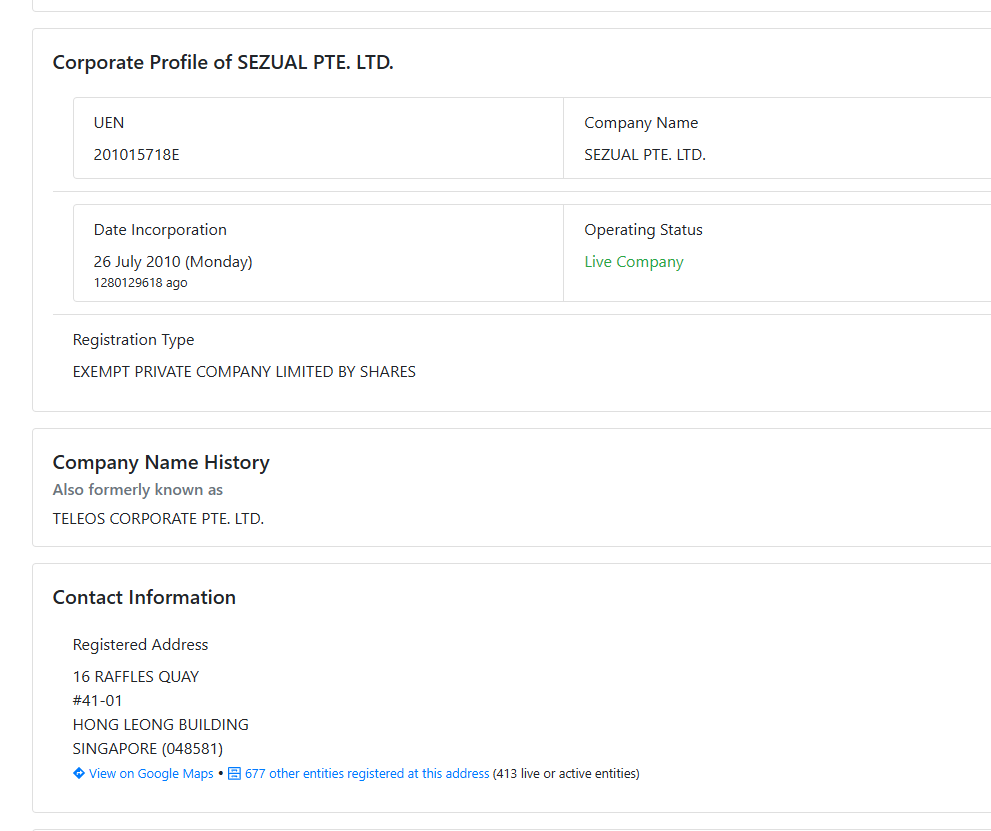
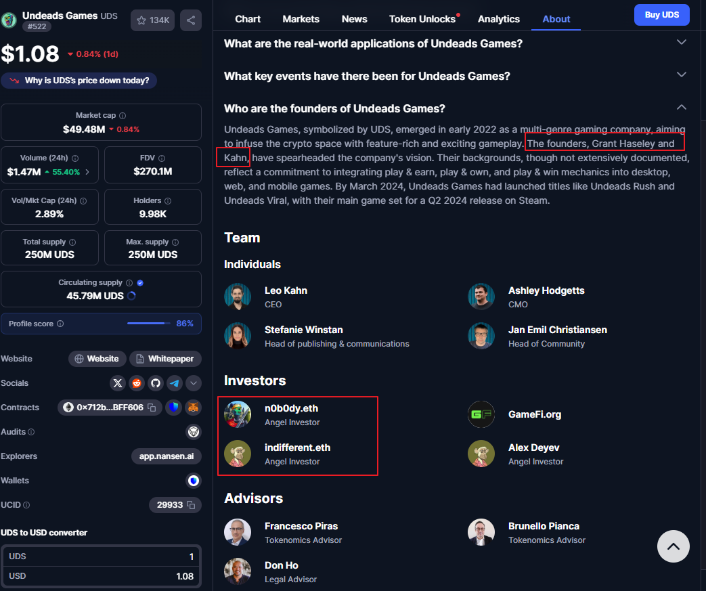
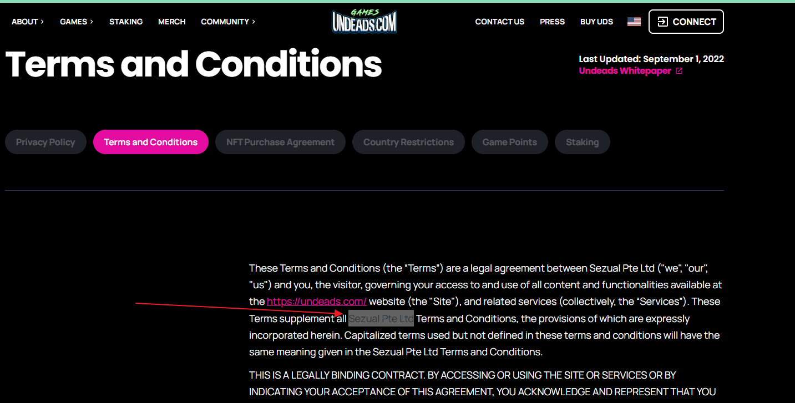
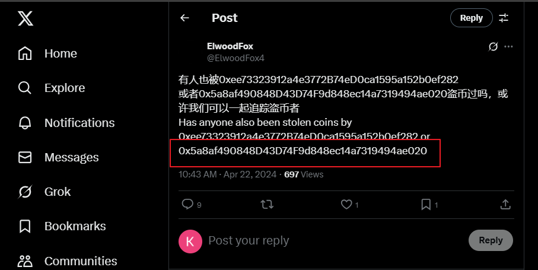
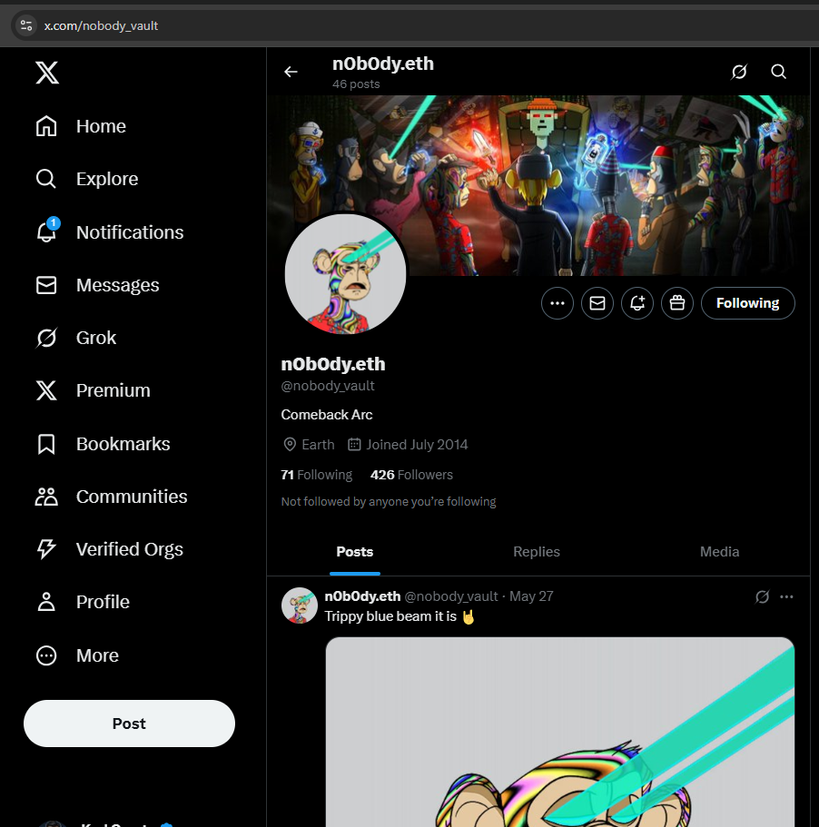
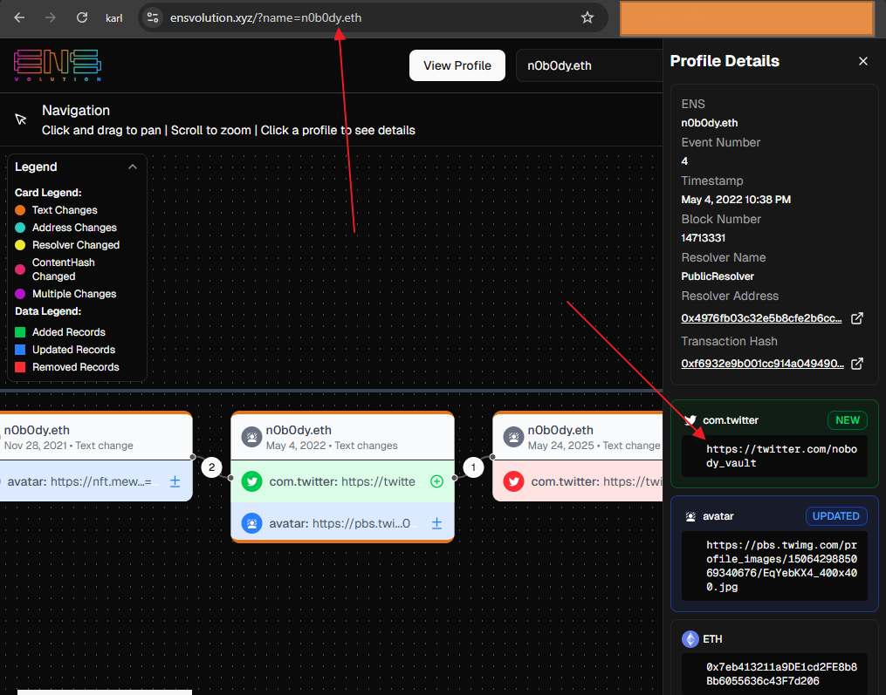
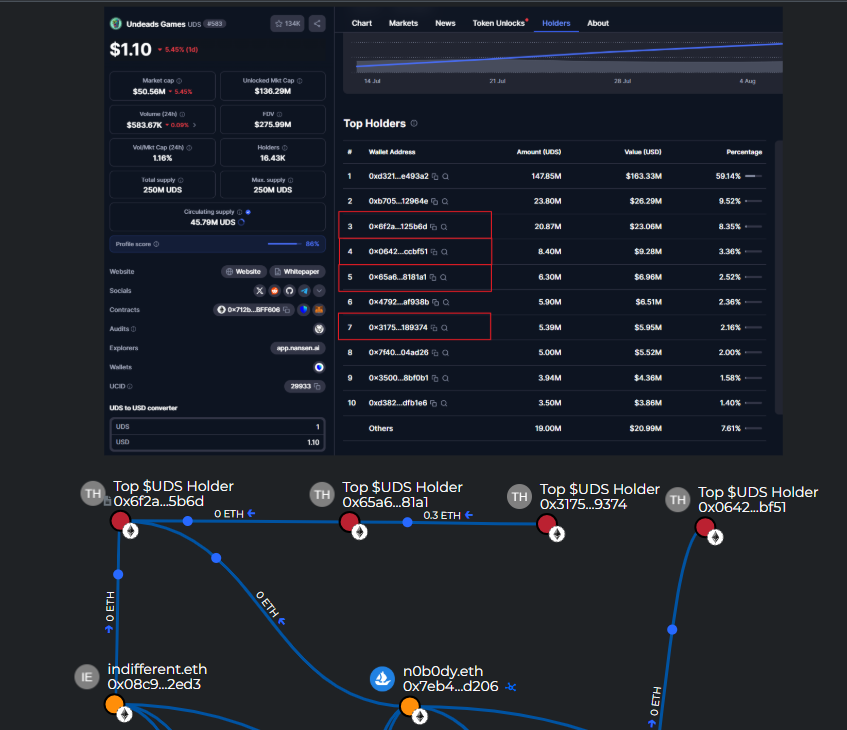

# All created images and screenshots of the Crypto investigation #0134

> [!IMPORTANT]
> The report is part of a big invesgation [Crypto Report #0134 Stolen 100 ETHs Leads to NFT Whales n0b0dy and indifferentguy (25mln$ worth) and a real company undeads.com (6mln$ investments and 50mln$ coin cap)](https://cryptokarl013.github.io/report-0134-stolen-ETHs-Leads-to-NFT-Whales-n0b0dy-indifferent-and-investments-into-a-real-company-undeadscom/).

## Images

