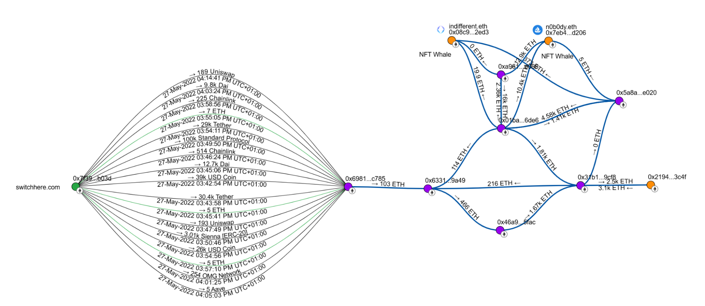
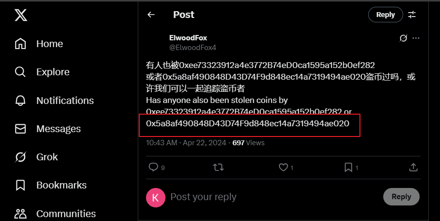

# Report #0134.0 Crypto theft from switchere.com connected with NFT Whales n0b0dy.eth and indifferent.eth

> [!IMPORTANT]
> The report is part of a big invesgation [Crypto Report #0134 Stolen 100 ETHs Leads to NFT Whales n0b0dy and indifferentguy (25mln$ worth) and a real company undeads.com (6mln$ investments and 50mln$ coin cap)](https://cryptokarl013.github.io/report-0134-stolen-ETHs-Leads-to-NFT-Whales-n0b0dy-indifferent-and-investments-into-a-real-company-undeadscom).

## Keywords
cryptotheft, indifferent.eth, n0b0dy.eth, kfox.eth, indifferentguy.eth, NFT whales, [switchere.com](http://switchere.com)

## Statements from other investigations

* **n0b0dy** and **indifferent** NFT Whales and has successfully raised $2 millions in funding through its Pre-Seed and Seed rounds into [undeads.com](http://undeads.com).

* The market cap of  [undeads.com](http://undeads.com) may be inflated or influenced by illicit funds originating from Nobody.eth and Indifferent.eth.

## Abstract

* In May 2022, over 100 ETH were stolen from a hot wallet of the [switchere.com](http://switchere.com) crypto exchange. By 2025, these stolen funds were traced to NFT whales __Indifferent.eth__ and __N0b0dy.eth__, who hold assets worth over $25 million.

* **Nobody.eth** and **Indifferent.eth**, both prominent NFT whales, appear to be controlled by a single individual or a coordinated group.

* **n0b0dy.eth**, **kfox.eth**, **indifferent.eth**, **indifferentguy.eth** addresses are managed by a single person or a coordinated group

### Theft fact

The EVM address [0x7f399e3c77c38c6571ff7114dc90a53357eab03d](https://etherscan.io/address/0x7f399e3c77c38c6571ff7114dc90a53357eab03d) was identified as an output hot wallet belonging to the crypto exchange [Switchere.com](http://switchere.com).

On May 27, 2022, Ethereum and 13 other EVM-compatible coins were transferred to a new, "clean" wallet [0x6981fe4eb847c9060861c24b3a1463ebd8b3c785](https://etherscan.io/address/0x6981fe4eb847c9060861c24b3a1463ebd8b3c78). The hot wallet was completely emptied within several hours.

The funds were withdrawn as a result of a hacker attack on switchere.com, after which the crypto exchange changed its hot wallets.

### Related wallets

All the coins held at the address [0x6981fe4eb847c9060861c24b3a1463ebd8b3c785](https://etherscan.io/address/0x6981fe4eb847c9060861c24b3a1463ebd8b3c78) were converted into Etherium. As a result >103 ETHs (216K$ in June 2022) were transferred to the [0x63312e37edcaacb21eb597323956d697821d9a49](https://etherscan.io/address/0x63312e37edcaacb21eb597323956d697821d9a49) address.

The [0x63312e37edcaacb21eb597323956d697821d9a49](https://etherscan.io/address/0x63312e37edcaacb21eb597323956d697821d9a49) wallet has funded from the address [0x01baea860c7661561c31b1f765cfe8e064ff6de6](https://etherscan.io/address/0x01baea860c7661561c31b1f765cfe8e064ff6de6) that also funded big NFT Whales [@n0b0dy.eth](https://web3.bio/n0b0dy.eth) (0x7eb413211a9de1cd2fe8b8bb6055636c43f7d206) and [@indifferent.eth](https://web3.bio/indifferent.eth) (0x7eb413211a9de1cd2fe8b8bb6055636c43f7d206).

The linked addresses [@n0b0dy.eth](https://web3.bio/n0b0dy.eth) and [@indifferent.eth](https://web3.bio/indifferent.eth) are believed to belong to a single individual or group.

All of these disclosed addresses are managed manually and crypto circulates around them: 

* [0x01baea860c7661561c31b1f765cfe8e064ff6de6](https://intel.arkm.com/explorer/address/0x01baeA860C7661561c31B1F765CfE8e064fF6De6) (Arkm detects it as nobody_vault) 
* [0x5a8af490848d43d74f9d848ec14a7319494ae020](https://intel.arkm.com/explorer/address/0x5a8af490848d43d74f9d848ec14a7319494ae020) ([Noticed in thefts](https://x.com/ElwoodFox4/status/1782344348153344139)) 
* 0x46a93a8d4440df32d2b13c03baecad28d3df5fac 
* 0x31b13fa1c6e786854f62fd0d6cb41d9b64639cf8 
* 0x2194f90d32df768c9bfdbd3215d677eaa6fc3c4f (21mln$ worth in Jan 2025) 
* 0xa9615dfa74c79b38ee144169b5e87dfba43ed066 
* [0x08c904a02578ed95a46c25a8cc510cd6ed9f2ed3](https://intel.arkm.com/explorer/address/0x08c904A02578ed95a46C25A8cC510CD6eD9F2ed3) (indifferent.eth, indifferentguy.eth, 23mln$ in Jun 2025) 
* [0x7eb413211a9de1cd2fe8b8bb6055636c43f7d206](https://intel.arkm.com/explorer/address/0x7eb413211a9DE1cd2FE8b8Bb6055636c43F7d206) (n0b0dy.eth, kfox.eth, 2.3mln$ in Jun 2024) 

**The Breadcrumb report visualizes the connections between addresses:**
[https://www.breadcrumbs.app/reports/17067?share=df899b2c-9c8a-4ee2-9120-17c8c430c85c](https://www.breadcrumbs.app/reports/17067?share=df899b2c-9c8a-4ee2-9120-17c8c430c85c) 

⚡ One of the addresses 0x5a8af490848d43d74f9d848ec14a7319494ae020 has been implicated in other thefts. The link: [https://x.com/ElwoodFox4/status/1782344348153344139](https://x.com/ElwoodFox4/status/1782344348153344139).

**Conclusions:**

* n0b0dy.eth and indifferent.eth, being "NFT whales," are managed by a single person or a coordinated group 
* n0b0dy.eth and indifferent.eth are connected with crypto thefts including the switchere.com case 

> [!IMPORTANT]
> For any further clarification regarding the current investigation, please contact [@cryptokarl013](https://github.com/cryptokarl013). Any assistance that helps enrich the investigation would be greatly appreciated.

**Related addresses:**\
0x6981fe4eb847c9060861c24b3a1463ebd8b3c785 
0x63312e37edcaacb21eb597323956d697821d9a49
0x01baea860c7661561c31b1f765cfe8e064ff6de6
0x5a8af490848d43d74f9d848ec14a7319494ae020
0x46a93a8d4440df32d2b13c03baecad28d3df5fac
0x31b13fa1c6e786854f62fd0d6cb41d9b64639cf8 
0x2194f90d32df768c9bfdbd3215d677eaa6fc3c4f
0xa9615dfa74c79b38ee144169b5e87dfba43ed066
0x08c904a02578ed95a46c25a8cc510cd6ed9f2ed3
0x7eb413211a9de1cd2fe8b8bb6055636c43f7d206
0x0859b65a5696d17bcc49463df8d1e1797b7e2a4d
