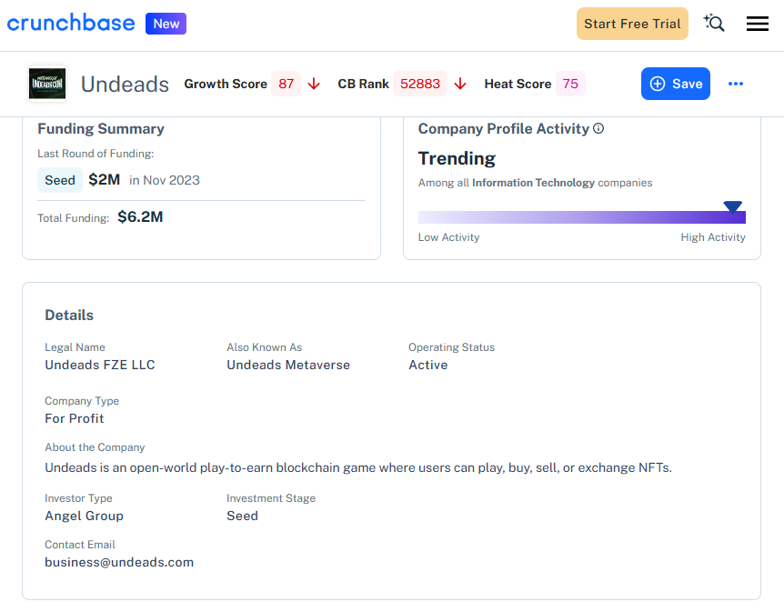
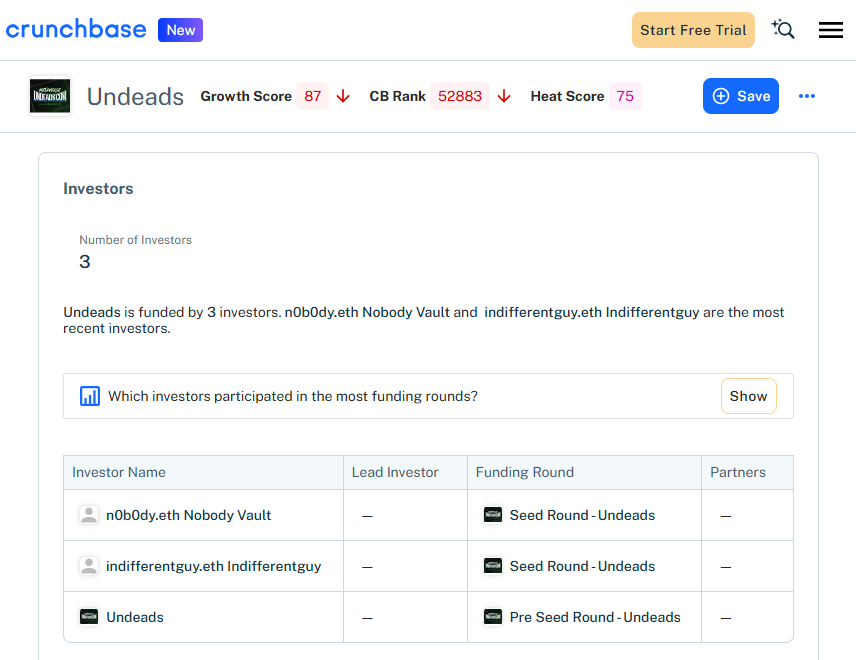
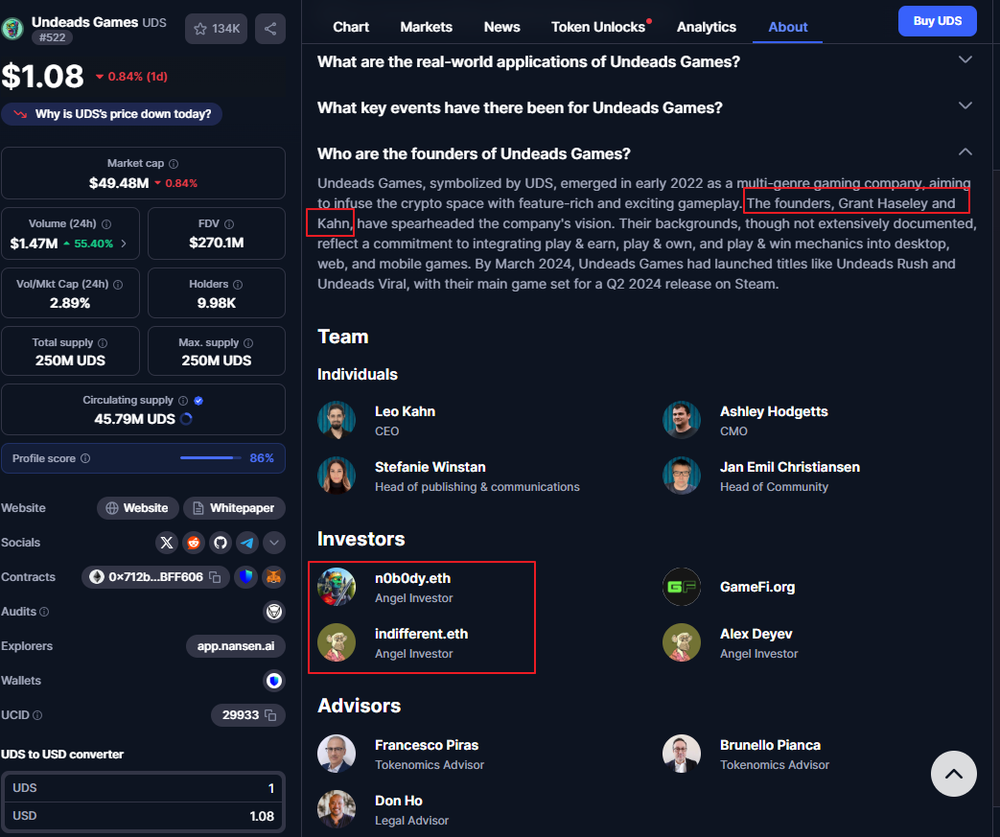
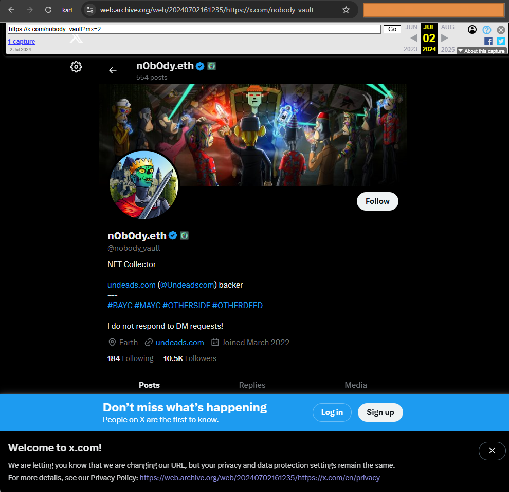
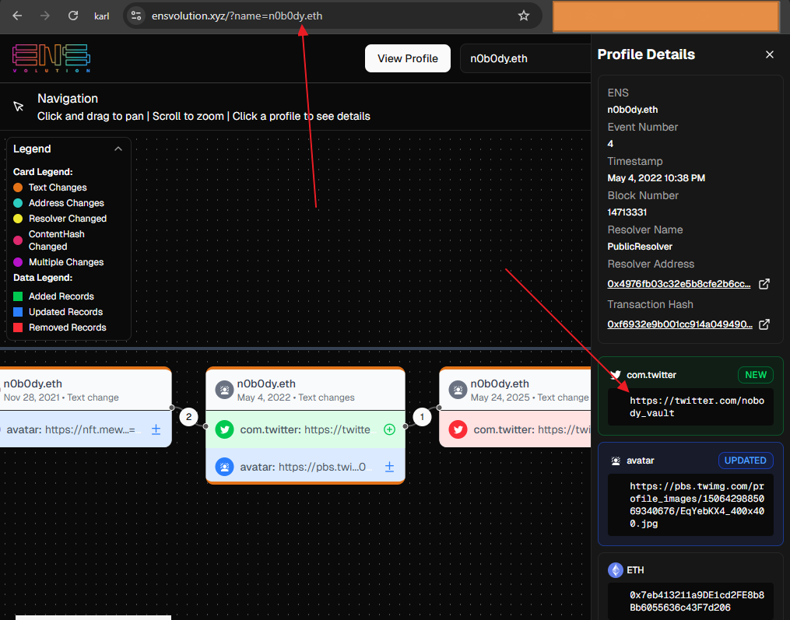
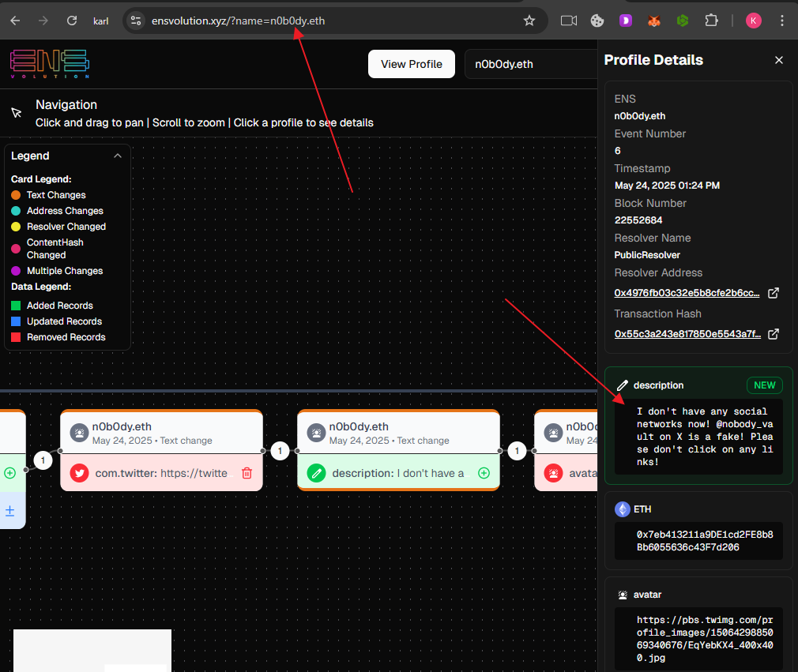
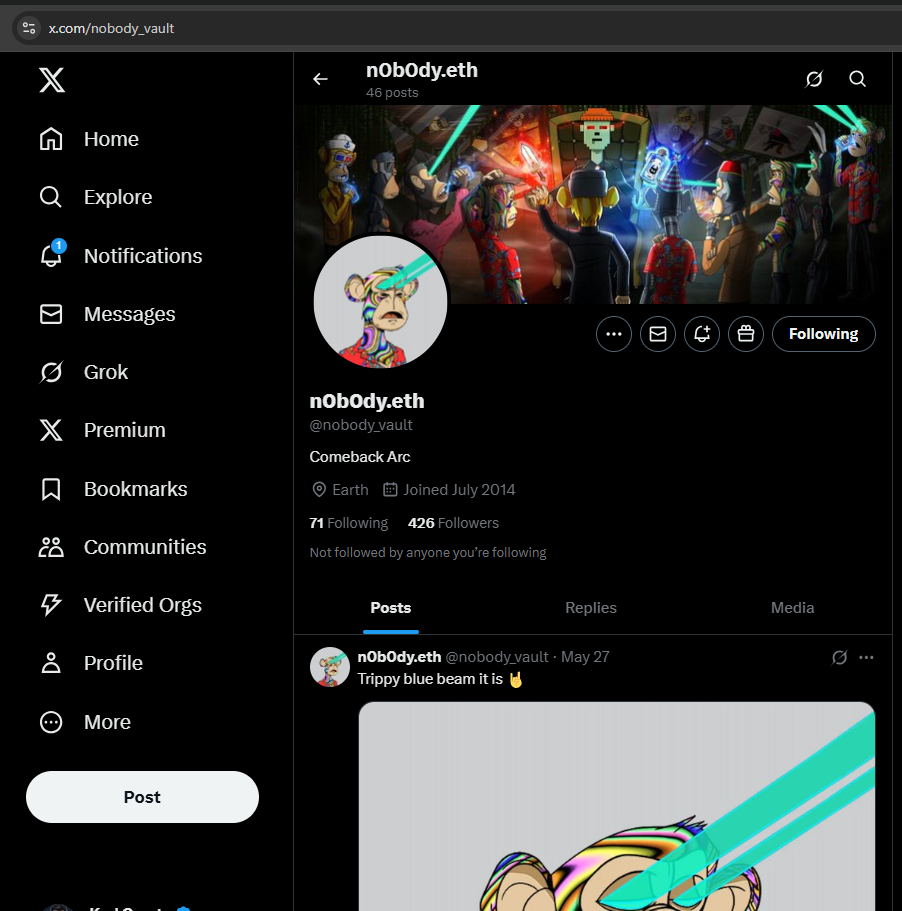

# Report #0134.1 NFT Whales n0b0dy.eth and indifferent.eth invested into a real company undeads.com and attempt to hide it

> [!NOTE]
> _**Update July 10, 2025:** some information started being changed after publishing the report (links between **Indifferent.eth**, **N0b0dy.eth** and **undeads.com** removed **Crunchbase**; **n0b0dy** removed any information in twitter connected with **undeads.com**). Refer to original screenshots or web archives.

> [! IMPORTANT]
> The report is part of a big invesgation [Crypto Report #0134 Stolen 100 ETHs Leads to NFT Whales n0b0dy and indifferentguy (25mln$ worth) and a real company undeads.com (6mln$ investments and 50mln$ coin cap)](https://cryptokarl013.github.io/report-0134-stolen-ETHs-Leads-to-NFT-Whales-n0b0dy-indifferent-and-investments-into-a-real-company-undeadscom).

## Keywords
crypto investments, indifferent.eth, n0b0dy.eth, NFT whales, [switchere.com](http://switchere.com)

## Statements from other investigations

* [**n0b0dy.eth** and **indifferent.eth** are connected with crypto thefts including the switchere.com case](https://cryptokarl013.github.io/report-0134-stolen-ETHs-Leads-to-NFT-Whales-n0b0dy-indifferent-and-investments-into-a-real-company-undeadscom/report-0134.0-crypto-theft-from-switchere.com-connected-with-nft-whales-n0b0dy.eth-and-indifferent.eth/)

* [**n0b0dy.eth**, **kfox.eth**, **indifferent.eth**, **indifferentguy.eth** are managed by a single individual or a coordinated group.](https://cryptokarl013.github.io/report-0134-stolen-ETHs-Leads-to-NFT-Whales-n0b0dy-indifferent-and-investments-into-a-real-company-undeadscom/report-0134.0-crypto-theft-from-switchere.com-connected-with-nft-whales-n0b0dy.eth-and-indifferent.eth/)

* [**Undeads.com** hides official legal entity information](https://cryptokarl013.github.io/report-0134-stolen-ETHs-Leads-to-NFT-Whales-n0b0dy-indifferent-and-investments-into-a-real-company-undeadscom/report-0134.2-undeadscom-lacks-clear-official-legal-entity-information)

## Abstract

* A legitimate company [Undeads.com](http://undeads.com) received more than $2 million in investments from **Indifferent.eth** and **N0b0dy.eth**

* * **n0b0dy.eth** and **indifferent.eth** tries to hide the information about funding into undeads.com

### Investments into undeads.com

According to Crunchbase, [Undeads.com](http://undeads.com) has only two listed investors, n0b0dy.eth and indifferent.eth, and has successfully raised $6.3 million in funding through its Pre-Seed and Seed rounds.

**Links:**

* [undeads.com](http://undeads.com) profile - [https://www.crunchbase.com/organization/undeads-fze-llc](https://www.crunchbase.com/organization/undeads-fze-llc) 
* n0b0dy.eth profile - [https://www.crunchbase.com/person/n0b0dy-eth-nobody-vault](https://www.crunchbase.com/person/n0b0dy-eth-nobody-vault) 
* indifferent.eth profile - [https://www.crunchbase.com/person/indifferentguy-eth-indifferentguy](https://www.crunchbase.com/person/indifferentguy-eth-indifferentguy) 

The [CoinMarketCap profile for undeads.com]((https://coinmarketcap.com/currencies/undeads-games/)) lists **n0b0dy.eth** and **indifferent.eth** as investors.

The link: [https://coinmarketcap.com/currencies/undeads-games/](https://coinmarketcap.com/currencies/undeads-games/) 

### Attempt n0b0dy to hide connection with undeads.com

Until May 2025 n0b0dy actively promoted undeads.com. 

See below the **n0b0dy twitter profile** from the web archive.\
The link: https://web.archive.org/web/20240702161235/https://x.com/nobody_vault

The Twitter profile [@nobody_vault](https://twitter.com/nobody_vault) is associated with the **n0b0dy.eth** account, according to ENS history.\
The link: https://www.ensvolution.xyz/?name=n0b0dy.eth

On May 24, 2025, **n0b0dy** disassociated his Twitter account from their ENS profile and deleted all content related to undeads.com.
The link: https://www.ensvolution.xyz/?name=n0b0dy.eth

In August 2025, the **n0b0dy.eth** Twitter account no longer mentions **undeads.com**.
The link: https://twitter.com/nobody_vault

### Conclusions
* A legitimate company [Undeads.com](http://undeads.com) received more than $2 million in investments from **Indifferent.eth** and **N0b0dy.eth**
* **n0b0dy.eth** tries to hide the information about funding about 2 mln into undeads.com

> [!IMPORTANT]
> For any further clarification regarding the current investigation, please contact [@cryptokarl013](https://cryptokarl013.github.com#contacts). Any assistance that helps enrich the investigation would be greatly appreciated.\
> The report's content is based on verifiable public information.

## Images
[All images and screenshots](https://cryptokarl013.github.io/report-0134-stolen-ETHs-Leads-to-NFT-Whales-n0b0dy-indifferent-and-investments-into-a-real-company-undeadscom/images)
