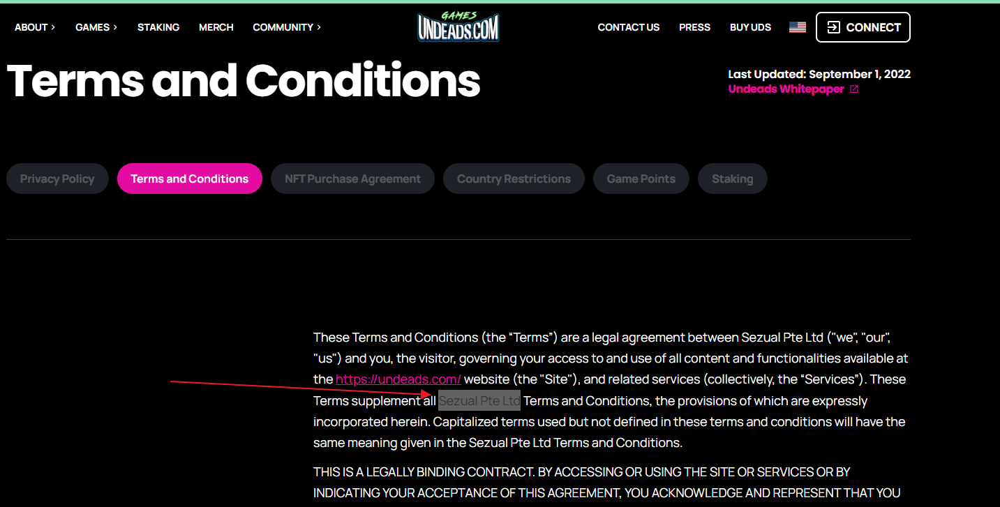
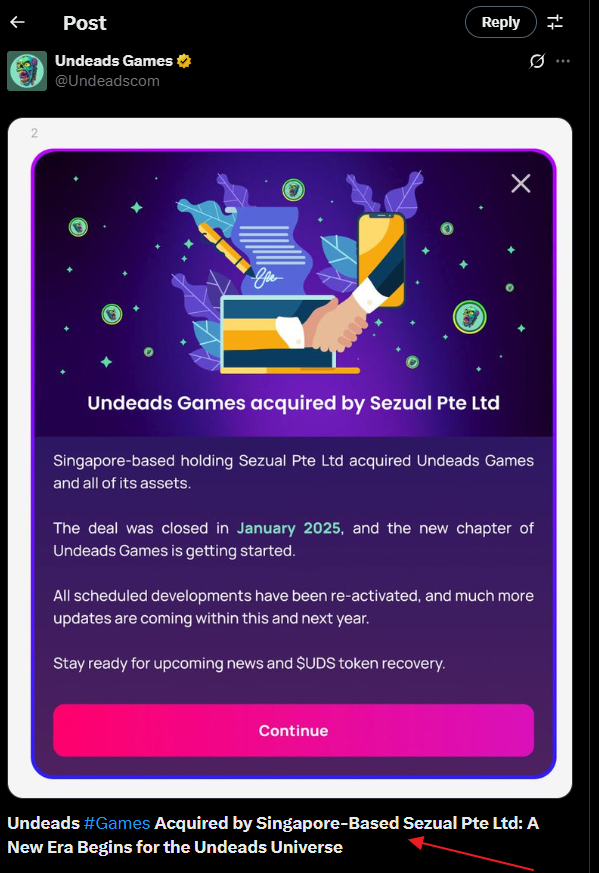
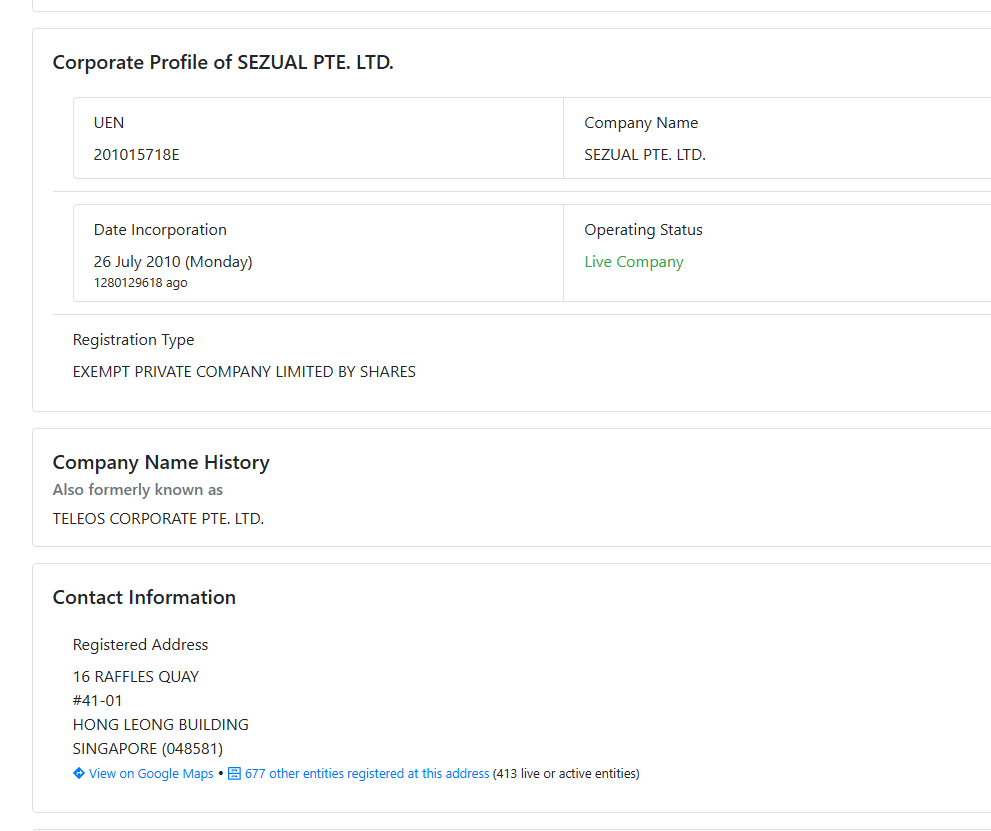
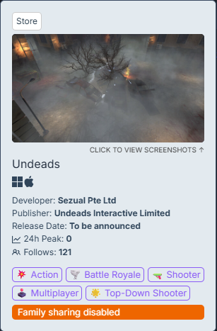
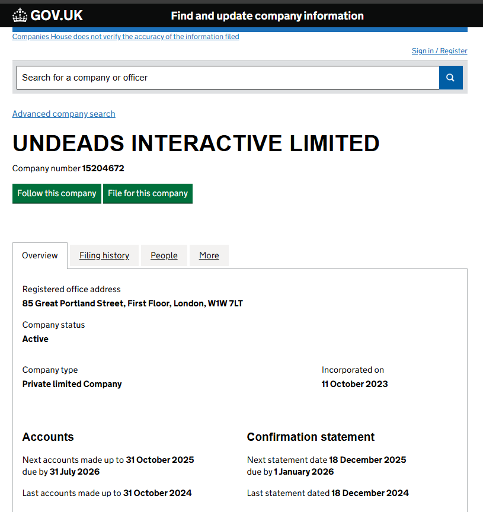
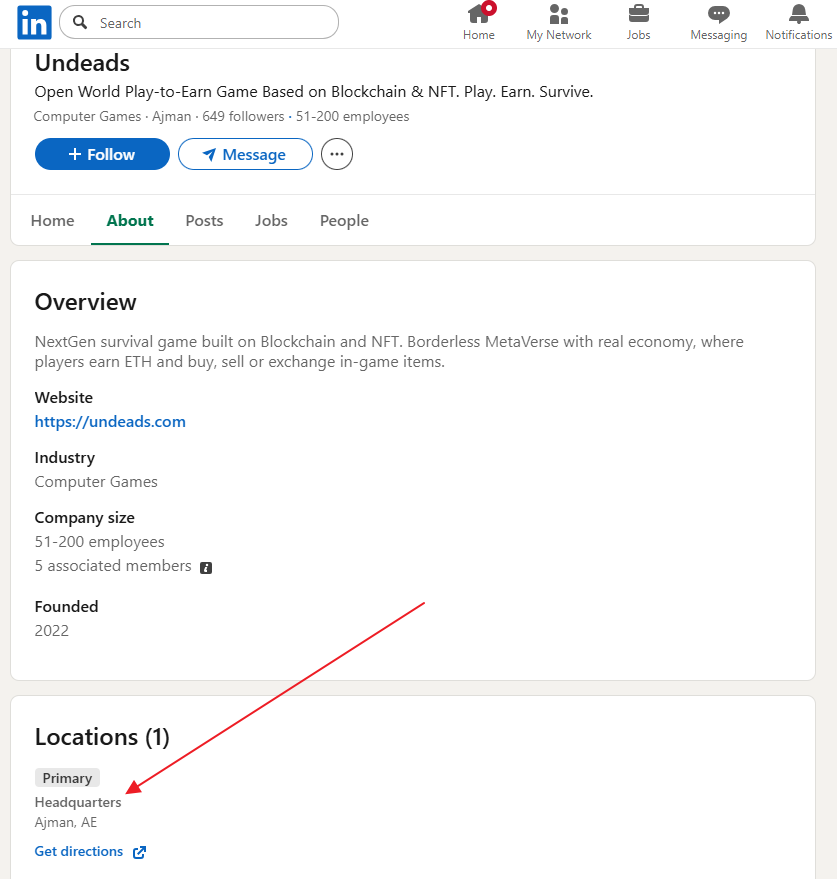
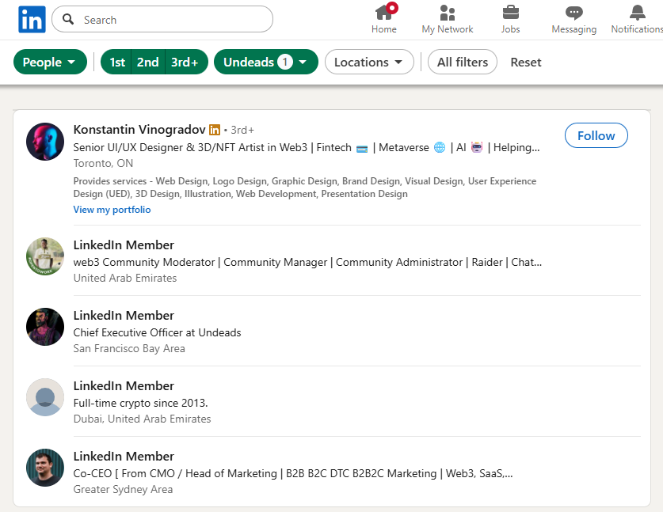
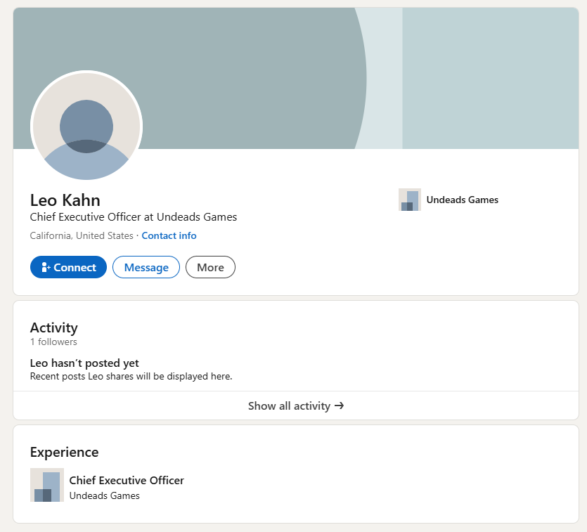

# Report #0134.2 Undeads.com hides official legal entity information

> [!NOTE]
> _**Update July 10, 2025:** some information started being changed after publishing the report. For example, links between **Indifferent.eth** and **N0b0dy.eth** removed from **undeads.com crunchbase portal**. Refer to original screenshots or web archives._

> [!IMPORTANT]
> The report is part of a big invesgation [Crypto Report #0134 Stolen 100 ETHs Leads to NFT Whales n0b0dy and indifferentguy (25mln$ worth) and a real company undeads.com (6mln$ investments and 50mln$ coin cap)](https://cryptokarl013.github.io/report-0134-stolen-ETHs-Leads-to-NFT-Whales-n0b0dy-indifferent-and-investments-into-a-real-company-undeadscom).

## Keywords
cryptotheft, indifferent.eth, n0b0dy.eth, NFT whales, [undeads.com](http://undeads.com), Sezual PTE. LTD., Undeads Interactive Limited, Grant Haseley, Leo Kahn

## Statements from other investigations

* **n0b0dy** and **indifferent** NFT Whales and has successfully raised $2 millions in funding through its Pre-Seed and Seed rounds into [undeads.com](http://undeads.com).

* **n0b0dy.eth**, **kfox.eth**, **indifferent.eth**, **indifferentguy.eth**, **undeeads.eth** addresses are managed by a single person or a coordinated group

* **n0b0dy** and **indifferent** are connected with a crypto theft on [switchere.com](http://switchere.com)

## Abstract

* ❗️It’s certainly a pertinent question for investors and the public alike. A company like Undeads, boasting millions in investments and a significant market cap >$50mln for its coin, yet maintaining a high degree of public opacity, raises several red flags and questions about its operational model.

* Hard to find information about legal company, founders, C-Level, employees.

* [undeads.com](http://undeads.com) hides official personal and company information intentionally The Undeads.com website does not provide information about the jurisdiction of a legal company. The founders of undeads.com do not have public accounts in social networks under undeads.com label. The Undeads company LinkedIn profile has only one open employee profile. All others are closed including C-level. 

### Unclear Undeads.com jusdiction

The Undeads.com website identifies **Sezual Pte Ltd** as its legal entity but _the website provides no information regarding its specific jurisdiction or operational residence_.

**Links:** [https://undeads.com/legal/terms](https://undeads.com/legal/terms) 

@undeadscom ([https://x.com/undeadscom](https://x.com/undeadscom)) twitter discloses that a based Sezual Pte Ltd company is registered in Singapore.

Officially, the SEZUAL PTE. LTD. company is listed as a software developer, but it specifically excludes games, which is an unusual classification given its activities:

SEZUAL PTE. LTD. (the "Company") is an Exempt Private Company Limited by Shares, incorporated on 26 July 2010 (Monday) in Singapore. The address of the Company's registered office is at the [HONG LEONG BUILDING](https://www.sgpbusiness.com/building/HONG-LEONG-BUILDING/048581) building. The Company current operating status is live and has been operating for 1280129618. This Company's principal activity is development of software and applications (except games and cybersecurity).

**Key Principal:** YEOW LIH REN 

**Previous Company Name:** TELEOS CORPORATE PTE. LTD. 

* [https://www.sgpbusiness.com/company/Sezual-Pte-Ltd](https://www.sgpbusiness.com/company/Sezual-Pte-Ltd) 
* [https://www.dnb.com/business-directory/company-profiles.sezual_pte_ltd.e65e611ea6bd54cb6efc89e43f986f42.html](https://www.dnb.com/business-directory/company-profiles.sezual_pte_ltd.e65e611ea6bd54cb6efc89e43f986f42.html) 

Until **Sezual Pte Ltd company** (_Singapore_) is considered as a main equity, the company **Undeads Interactive Limited** (_London_) is a publisher.

The Undeads LinkedIn account states about Headquarters in the United Arab Emirates.

[Undeads.com](http://undeads.com) has their own coin UDS that is listed on [coinmarketcap.com](http://coinmarketcap.com) and other crypto exchanges. Market Cap: ~$50M in June 2025.

The link: [https://coinmarketcap.com/currencies/undeads-games/](https://coinmarketcap.com/currencies/undeads-games/) 

Despite receiving millions in investments and their coin having a market cap of $50 million, [Undeads.com](http://undeads.com) lacks clear, official legal entity information. This makes determining the proper jurisdiction for complaints difficult, as various entities are mentioned: Sezual Pte Ltd (Singapore), Undeads Interactive Limited (London), and a headquarters in the UAE.

### Public faces of the company in [Undeads.com](http://undeads.com)

The publicly named founders of Undeads.com, **Grant Haseley** and **Leo Kahn**, do not appear to have official accounts in social networks directly affiliated with the "undeads.com" label.

**Grant Haseley (Founder, USA)** 

* Personal Facebook account (no undeads mentioned except t-shirt undeads logo on a photo) - [https://www.facebook.com/grant.haseley](https://www.facebook.com/grant.haseley) 
* LinkedIn: [https://www.linkedin.com/in/grant-haseley-116a2398/](https://www.linkedin.com/in/grant-haseley-116a2398/) (_Vice President - FP&A, Data Analytics & Modernization at M&T Bank, no undeads mentioned_) 
* No searchable [X.com](http://x.com) accounts 

**Leo Kahn (Founder, CEO, USA)** 

* No searchable Facebook, [X.com](http://x.com) accounts 
* Just a couple videos from conferences - [https://www.facebook.com/watch/?v=1002586494443152&rdid=9FWHCUvtOp07cB39](https://www.facebook.com/watch/?v=1002586494443152&rdid=9FWHCUvtOp07cB39) 

It's unusual for a company of Undeads' stated size (50+ employees) to have only one publicly visible employee profile on LinkedIn, with all others hidden or private (including accounts of C-level). This is atypical for businesses aiming for transparency and professional networking.

The link: [https://www.linkedin.com/company/undeadscom/](https://www.linkedin.com/company/undeadscom/) 

This is the LinkedIn profile of the CEO of Undeads.com:

Here are the other individuals whose real identities have been disclosed: 

* Roman Roshchuk (position: unknown, Ukraine) - [https://x.com/roshchuck](https://x.com/roshchuck) 
* Konstantin Vinogradov (UX Designer) - [https://www.linkedin.com/in/cryptodesigner/](https://www.linkedin.com/in/cryptodesigner/) 
* Julija Gorska (Director of UNDEADS INTERACTIVE LIMITED) - [https://find-and-update.company-information.service.gov.uk/officers/1jv2YxrvVmteUvtWa9thPZQBxNU/appointments](https://find-and-update.company-information.service.gov.uk/officers/1jv2YxrvVmteUvtWa9thPZQBxNU/appointments) 
* Vasil Dimitrov (Ex-Director of UNDEADS INTERACTIVE LIMITED) - [https://find-and-update.company-information.service.gov.uk/officers/Kfuhx6hTqxkHl0cuCF0QYabbhIE/appointments](https://find-and-update.company-information.service.gov.uk/officers/Kfuhx6hTqxkHl0cuCF0QYabbhIE/appointments) 

❗️It's certainly a pertinent question for investors and the public alike. A company like Undeads, boasting millions in investments and a significant market cap >$50mln for its coin, yet maintaining a high degree of public opacity, raises several red flags and questions about its operational model.

> [!IMPORTANT]
> For any further clarification regarding the current investigation, please contact [@cryptokarl013](https://cryptokarl013.github.com#contacts). Any assistance that helps enrich the investigation would be greatly appreciated.\
> The report's content is based on verifiable public information.

> [Other investigations by @cryptokarl013](https://cryptokarl013.github.io/)

## Images
[All images and screenshots](https://cryptokarl013.github.io/report-0134-stolen-ETHs-Leads-to-NFT-Whales-n0b0dy-indifferent-and-investments-into-a-real-company-undeadscom/images)
