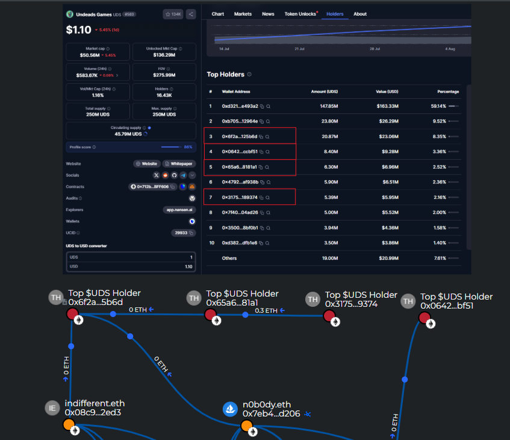
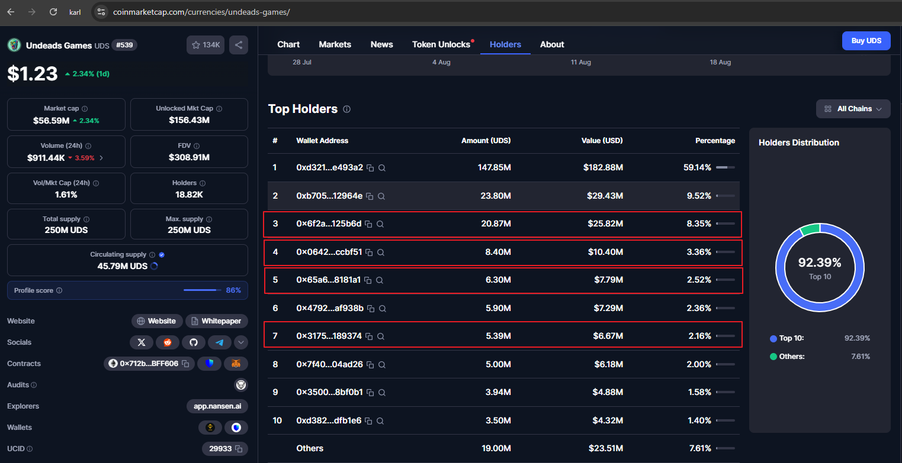
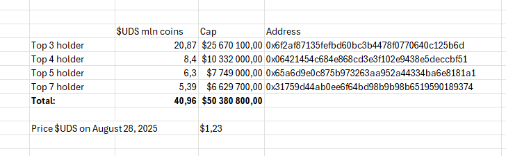

# Crypto Report #0134.3 40% of $UDS coin unlocked marked cap (>40mln$ in August 2025) connected with indifferentguy and n0b0dy NFT whales

> [!IMPORTANT]
> The report is part of a big invesgation [Crypto Report #0134 Stolen 100 ETHs Leads to NFT Whales n0b0dy and indifferentguy (25mln$ worth) and a real company undeads.com (6mln$ investments and 50mln$ coin cap)](https://cryptokarl013.github.io/report-0134-stolen-ETHs-Leads-to-NFT-Whales-n0b0dy-indifferent-and-investments-into-a-real-company-undeadscom/).

## Keywords

indifferent.eth, undeads.eth, [undeads.com](http://undeads.com), Top 10 $UDS coin holders

## Statements from related investigations

* **n0b0dy.eth** and **indifferent.eth** are connected with crypto thefts including the [switchere.com case](https://cryptokarl013.github.io/report-0134-stolen-ETHs-Leads-to-NFT-Whales-n0b0dy-indifferent-and-investments-into-a-real-company-undeadscom/report-0134.0-crypto-theft-from-switchere.com-connected-with-nft-whales-n0b0dy.eth-and-indifferent.eth/)

* **n0b0dy.eth** and **indifferent.eth** are managed by a single person or a coordinated group

* [Undeads.com](http://undeads.com) has been funded with illicit money provided by investors **n0b0dy.eth** and **indifferent.eth**.

* **n0b0dy.eth** tries to hide the information about funding into [Undeads.com](http://undeads.com)

* **undeads.com** hides official company information intentionally (_unclear legal jurisdiction, no public accounts of C-Level, empty LinkedIn in profiles_). 

## Abstract
* In August 2025, over $40 million of the unlocked market capitalization for the __$UDS__ coin is tied to two NFT whale investors, **indifferentguy** and **n0b0dy**. This represents $40%$ of the total unlocked supply.

* 4 of top 10 #UDS holders are connected witn NFT whales __Indifferent.eth__ and __N0b0dy.eth__

## The relationships

On June 23, 2025 **n0b0dy.eth** moved $UDS coins (~1.7mln$) to the address `0x6f2af87135fefbd60bc3b4478f0770640c125b6d`. 

On August 9, 2025 **indifferent.eth** moved his $UDS coins (~700K$) to the same address `0x6f2af87135fefbd60bc3b4478f0770640c125b6d`. 

The breadcrumbs reports shows relations between **Top $UDS holders**, __Indifferent.eth__ and __N0b0dy.eth__.
The links: 
* only related wallets: [https://www.breadcrumbs.app/reports/19153?share=54d7a1cc-b24c-4d66-bc1e-d26e0ad40243](https://www.breadcrumbs.app/reports/19153?share=54d7a1cc-b24c-4d66-bc1e-d26e0ad40243)
* full picture: [https://www.breadcrumbs.app/reports/17067?share=df899b2c-9c8a-4ee2-9120-17c8c430c85c](https://www.breadcrumbs.app/reports/17067?share=df899b2c-9c8a-4ee2-9120-17c8c430c85c) 

With around $50 million (>40%) of the unlocked $UDS market cap under the control of n0b0dy.eth and indifferentguy.eth, there's a risk that these individuals could destabilize the $UDS coin at any time.

## Conclusions
* A single individual or a coordinated group, operating under the pseudonyms **n0b0dy.eth** and **indifferentguy.eth**, controls roughly 40% of the unlocked market capitalization. This significant concentration of holdings is a major risk for the UDS token holder community.

## Images
[All images and screenshots](https://cryptokarl013.github.io/report-0134-stolen-ETHs-Leads-to-NFT-Whales-n0b0dy-indifferent-and-investments-into-a-real-company-undeadscom/images/)

## Related Wallets
0x08c904a02578ed95a46c25a8cc510cd6ed9f2ed3 
0x7eb413211a9de1cd2fe8b8bb6055636c43f7d206 
0x5a8af490848d43d74f9d848ec14a7319494ae020 
0x6f2af87135fefbd60bc3b4478f0770640c125b6d 
0x65a6d9e0c875b973263aa952a44334ba6e8181a1 
0x31759d44ab0ee6f64bd98b9b98b6519590189374 
0x06421454c684e868cd3e3f102e9438e5deccbf51 

> [!IMPORTANT]
> For any further clarification regarding the current investigation, please contact [@cryptokarl013](https://cryptokarl013.github.io#contacts). Any assistance that helps enrich the investigation would be greatly appreciated.\
> The report's content is based on verifiable public information.

> [Other investigations by @cryptokarl013](https://cryptokarl013.github.io)
