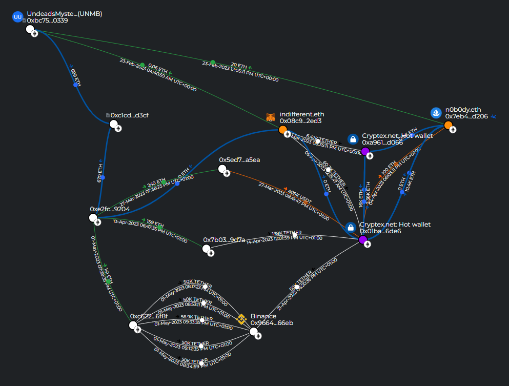

# Crypto Report #0134.4 Undeads.com routed ~$1M through OFAC-sanctioned Cryptex.net while its investors n0b0dy.eth and indifferent.eth received funds from the same mixer

> [!IMPORTANT]
> The report is part of a big invesgation [Crypto Report #0134 Stolen 100 ETHs Leads to NFT Whales n0b0dy and indifferentguy (25mln$ worth) and a real company undeads.com (6mln$ investments and 50mln$ coin cap)](https://cryptokarl013.xyz/report-0134-stolen-ETHs-Leads-to-NFT-Whales-n0b0dy-indifferent-and-investments-into-a-real-company-undeadscom/).

## Keywords

crypto laundering, Cryptex.net, OFAC sanctions, indifferent.eth, indifferentguy.eth, n0b0dy.eth, undeads.com, UndeadsMysteryBox, Binance, money laundering, CryptexPay, sanctioned exchange, crypto mixer, crypto report, crypto investigation

## Statements from related investigations

* **n0b0dy.eth** and **indifferent.eth** are managed by a single person or a coordinated group - [Report #0134.0](https://cryptokarl013.xyz/report-0134-stolen-ETHs-Leads-to-NFT-Whales-n0b0dy-indifferent-and-investments-into-a-real-company-undeadscom/report-0134.0-crypto-theft-from-switchere.com-connected-with-nft-whales-n0b0dy.eth-and-indifferent.eth/)

* [Undeads.com](http://undeads.com) has been funded with illicit money provided by investors **n0b0dy.eth** and **indifferent.eth** - [Report #0134.1](https://cryptokarl013.xyz/report-0134-stolen-ETHs-Leads-to-NFT-Whales-n0b0dy-indifferent-and-investments-into-a-real-company-undeadscom/report-0134.1-n0b0dy.eth-and-indifferent.eth-invest-in-undeads.com-and-attempt-to-hide-it/)

* **n0b0dy.eth** tries to hide the information about funding into [Undeads.com](http://undeads.com) - [Report #0134.1](https://cryptokarl013.xyz/report-0134-stolen-ETHs-Leads-to-NFT-Whales-n0b0dy-indifferent-and-investments-into-a-real-company-undeadscom/report-0134.1-n0b0dy.eth-and-indifferent.eth-invest-in-undeads.com-and-attempt-to-hide-it/)

* A single individual or a coordinated group controls roughly [40% of the unlocked $UDS market capitalization](https://cryptokarl013.xyz/report-0134-stolen-ETHs-Leads-to-NFT-Whales-n0b0dy-indifferent-and-investments-into-a-real-company-undeadscom/report-0134.3-40-percent-of-$UDS-coin-unlocked-marked-cap-connected-with-indifferentguy-and-n0b0dy-NFT-whales/) - [Report #0134.3](https://cryptokarl013.xyz/report-0134-stolen-ETHs-Leads-to-NFT-Whales-n0b0dy-indifferent-and-investments-into-a-real-company-undeadscom/report-0134.3-40-percent-of-$UDS-coin-unlocked-marked-cap-connected-with-indifferentguy-and-n0b0dy-NFT-whales/)

## Abstract

* **n0b0dy.eth** and **indifferent.eth** used [Cryptex.net](https://cryptex.net) - a platform known for facilitating anonymous cryptocurrency transactions.

* On-chain evidence shows that stolen ETH and other assets were routed through Cryptex.net before being redistributed to wallets controlled by **n0b0dy.eth** and **indifferent.eth**.

* Between March and May 2023, [Undeads.com](http://undeads.com) transferred a total of **540 ETH (~$970,000** at spring 2023 prices) to intermediary wallets that forwarded the funds to Cryptex.net hot wallets and Binance.

* The use of Cryptex.net as an intermediary demonstrates a deliberate attempt to obscure the origin of illicit funds.

## What is Cryptex.net

[Cryptex.net](https://cryptex.net) was a cryptocurrency exchange registered in **Saint Vincent and the Grenadines** but predominantly operating within **Russia**. On **September 26, 2024**, the U.S. Treasury Department's Office of Foreign Assets Control ([OFAC](https://ofac.treasury.gov/recent-actions/20240926)) sanctioned Cryptex under Executive Orders 13694 and 14024, designating it as a major money laundering platform.

Key facts about Cryptex:
* Processed over **$5.88 billion** in cryptocurrency transactions over its lifetime
* Received more than **$51.2 million** in funds derived from **ransomware attacks**
* Associated with over **$720 million** in transactions connected to Russia-based ransomware actors, fraud shops, mixing services, and darknet markets
* Operated by **Sergey Sergeevich Ivanov** (also known as "Taleon"), a Russian money launderer who processed hundreds of millions of dollars for cybercriminals over approximately 20 years
* The U.S. Department of State offered a **$10 million reward** for information leading to Ivanov's arrest or conviction
* Cryptex's payment processor, **CryptexPay**, employed advanced obfuscation by generating new wallet addresses for each transaction and mixing deposits - making it extremely difficult for authorities to trace criminal proceeds
* Dutch authorities (FIOD and NHCTU), coordinating with the U.S. Secret Service, seized Cryptex's infrastructure and domains, recovering **€7 million** in cryptocurrency from servers hosted in the Netherlands
* The Netherlands Police, the Dutch Fiscal Intelligence and Investigation Service (FIOD), and the German Federal Criminal Police (BKA), as part of **Operation Endgame**, provided substantial assistance in the case


_Source: [web.archive.org snapshot of cryptex.net](https://web.archive.org/web/20251031223642/https://cryptex.net/) showing the seizure warrant issued by the United States District Court for the District of Maryland._

## Money laundering via Cryptex.net

The on-chain investigation reveals that wallets associated with **n0b0dy.eth** and **indifferent.eth** interacted with Cryptex.net to process and obscure the origin of funds.

Specifically, **n0b0dy.eth** and **indifferent.eth** used two Cryptex.net hot wallets:
* [0xa9615dfa74c79b38ee144169b5e87dfba43ed066](https://intel.arkm.com/explorer/address/0xa9615dfa74c79b38ee144169b5e87dfba43ed066) ([Etherscan](https://etherscan.io/address/0xa9615dfa74c79b38ee144169b5e87dfba43ed066))
* [0x01baea860c7661561c31b1f765cfe8e064ff6de6](https://intel.arkm.com/explorer/address/0x01baea860c7661561c31b1f765cfe8e064ff6de6) ([Etherscan](https://etherscan.io/address/0x01baea860c7661561c31b1f765cfe8e064ff6de6))

The Breadcrumbs report visualizes the flow of funds between the investigated wallets and Cryptex:
[https://www.breadcrumbs.app/reports/39217?share=18e383c8-dbe7-4c72-8084-e2ec3c962d6e](https://www.breadcrumbs.app/reports/39217?share=18e383c8-dbe7-4c72-8084-e2ec3c962d6e)



## On-chain evidence

The on-chain transaction data reveals multiple transactions between 11 wallets during **February–May 2023**, tracing the full laundering cycle from Cryptex.net through n0b0dy.eth and indifferent.eth to Undeads.com and Binance.

### Wallets involved

| Address | Identity |
|---------|----------|
| [0x7eb413211a9de1cd2fe8b8bb6055636c43f7d206](https://etherscan.io/address/0x7eb413211a9de1cd2fe8b8bb6055636c43f7d206) | **n0b0dy.eth** |
| [0x08c904a02578ed95a46c25a8cc510cd6ed9f2ed3](https://etherscan.io/address/0x08c904a02578ed95a46c25a8cc510cd6ed9f2ed3) | **indifferent.eth** |
| [0xa9615dfa74c79b38ee144169b5e87dfba43ed066](https://intel.arkm.com/explorer/address/0xa9615dfa74c79b38ee144169b5e87dfba43ed066) | **Cryptex.net hot wallet #1** |
| [0x01baea860c7661561c31b1f765cfe8e064ff6de6](https://intel.arkm.com/explorer/address/0x01baea860c7661561c31b1f765cfe8e064ff6de6) | **Cryptex.net hot wallet #2** |
| [0xbc75da5ad73edf07b1dd38c4b158f45318f30339](https://intel.arkm.com/explorer/address/0xbc75da5ad73edf07b1dd38c4b158f45318f30339) | **UndeadsMysteryBox (UNMB)** - [Undeads.com](http://undeads.com) wallet |
| [0x9664465588585758823b4b49079cc668097f66eb](https://intel.arkm.com/explorer/address/0x9664465588585758823b4b49079cc668097f66eb) | **Binance Deposit Wallet** |
| [0xe2fc8fcae91f0bb046367d198861731a068a9204](https://intel.arkm.com/explorer/address/0xe2fc8fcae91f0bb046367d198861731a068a9204) | **[Undeads.com](http://undeads.com) wallet** |
| [0xc1cd80849b138909c5599096c0cab36c229ed3cf](https://intel.arkm.com/explorer/address/0xc1cd80849b138909c5599096c0cab36c229ed3cf) | **[Undeads.com](http://undeads.com) TransparentUpgradeableProxy** (smart contract) |
| [0x5ed706e051605df8b58844572fa3cf16d2eda5ea](https://etherscan.io/address/0x5ed706e051605df8b58844572fa3cf16d2eda5ea) | Intermediary wallet |
| [0x7b03a5d14332b4111ee839f8956f7efe31b69d7a](https://etherscan.io/address/0x7b03a5d14332b4111ee839f8956f7efe31b69d7a) | Intermediary wallet |
| [0xc622a675cf2bccc88162e777a1f3e0a275f96f8f](https://etherscan.io/address/0xc622a675cf2bccc88162e777a1f3e0a275f96f8f) | Intermediary wallet |

> [!NOTE]
> By May 2023, **n0b0dy.eth** and **indifferent.eth** had received funds from two Cryptex.net hot wallets: **~90K USDT** to **indifferent.eth** and **~23K ETH** to **n0b0dy.eth**. See the full [Breadcrumbs report](https://www.breadcrumbs.app/reports/39217?share=18e383c8-dbe7-4c72-8084-e2ec3c962d6e) for details.

### Step 1: n0b0dy.eth and indifferent.eth fund the Undeads.com wallet (February 23, 2023)

On **February 23, 2023**, **n0b0dy.eth** sent **20 ETH** to the **UndeadsMysteryBox (UNMB)** wallet (`0xbc75...39`):
[0x64fbef3a556c176d5b3c947b080e4dcec619a4ca00510f64fa7ce3f6f897e38c](https://etherscan.io/tx/0x64fbef3a556c176d5b3c947b080e4dcec619a4ca00510f64fa7ce3f6f897e38c)

On **February 23, 2023**, **indifferent.eth** sent **0.06 ETH** to the same **UndeadsMysteryBox (UNMB)** wallet (`0xbc75...39`):
[0xb5d198c43334b88ce314207bee190fa244166208850eff23f67d2b64798d4efe](https://etherscan.io/tx/0xb5d198c43334b88ce314207bee190fa244166208850eff23f67d2b64798d4efe)

> [!NOTE]
> Both **n0b0dy.eth** and **indifferent.eth** sent funds to the **same Undeads.com wallet** (UndeadsMysteryBox) **at the same date**, further confirming the direct financial relationship between these wallets and the [Undeads.com](http://undeads.com) project.

### Step 2: Undeads.com wallet sends funds to Cryptex via intermediary (March 27, 2023)

* **March 27, 2023**: Undeads.com (`0xe2fc...04`) → intermediary (`0x5ed7...ea`): **240 ETH** ([tx](https://etherscan.io/tx/0x9e513fe4346bbcb657e3a020300ec2a52728b48fe77701569f64bf3f2a3aa27e))
* **March 27, 2023**: Intermediary (`0x5ed7...ea`) → Cryptex hot wallet #2: **409,245 USDT** ([tx](https://etherscan.io/tx/0xd4a5f00b5f0432beff0c44a882e499ee4cb24cba99e9162e0e9739702e2e675e))

### Step 3: Cryptex.net sends funds to n0b0dy.eth and indifferent.eth (April 4–5, 2023)

On **April 4, 2023**, Cryptex hot wallet #2 sent **100 ETH** to **n0b0dy.eth** (`0x7eb4...06`):
[0xe82d496d785c6dbb8ef5c106a9b2a0b47c2a9be25ba61d944a438def999f0543](https://etherscan.io/tx/0xe82d496d785c6dbb8ef5c106a9b2a0b47c2a9be25ba61d944a438def999f0543)

On **April 5, 2023**, Cryptex hot wallet #2 sent **60,222 USDT** to **indifferent.eth** (`0x08c9...d3`):
[0x4f047877cc2fc94d4dd55ed9f12ebcc2e6b00c7c81f1345c2e09494f2a04eee7](https://etherscan.io/tx/0x4f047877cc2fc94d4dd55ed9f12ebcc2e6b00c7c81f1345c2e09494f2a04eee7)

### Step 4: Undeads.com wallet sends funds to Cryptex and Binance via intermediaries (April 13–21, 2023)

* **April 13, 2023**: Undeads.com (`0xe2fc...04`) → intermediary (`0x7b03...7a`): **159 ETH** ([tx](https://etherscan.io/tx/0xb830a4895a6b8ea5ec1173e8c6ac4f08d6e81b3459b6b49f0dbe50f346ab2984))
* **April 14, 2023**: Intermediary (`0x7b03...7a`) → Cryptex hot wallet #2: **138,083 USDT** ([tx](https://etherscan.io/tx/0x41921fd3317b179971f11e0594f1b1c4e54af0a71ed980bef454abb2108b8eb1))
* **April 21, 2023**: Cryptex hot wallet #2 → Binance: **50,000 USDT** ([tx](https://etherscan.io/tx/0x7027aebe6fa1cbc848716f71fe321d8ef511e30fb245379e68d02bd82daf7e86))

### Step 5: Undeads.com wallet routes funds through intermediary to Binance (May 1, 2023)

* **May 1, 2023**: Undeads.com (`0xe2fc...04`) → intermediary (`0xc622...8f`): **141 ETH** ([tx](https://etherscan.io/tx/0x3527e4ad4acfcf53524cc7df9d2a1f994598662352833ab78703425be9a18a40))
* **May 1, 2023**: Intermediary (`0xc622...8f`) → Binance: **5 transactions** totaling **256,946 USDT** ([tx1](https://etherscan.io/tx/0x244a1c2fc7676f90f234fa34fe14d645329a42c53d95c44276e12b749a36b48a), [tx2](https://etherscan.io/tx/0xdce5c1e7baa0ac6fd3b86e98fb957578f428cc378f56e64cc559ab01badac924), [tx3](https://etherscan.io/tx/0xdeea8734261daca94a09bfabc5967482db4674fa3dd465dfa40ca554295baf2a), [tx4](https://etherscan.io/tx/0xdd83693327730f9537cd1fd2a1ed44069485bec997ea8e48190a5f2da2f94f30), [tx5](https://etherscan.io/tx/0x88251c4d7ca1fd3b85fd157a9e916ac0bb8751580124dfda2f3ccb34523ed0fe))

### Summary

In total, the Undeads.com wallet (`0xe2fc...04`) sent **540 ETH (~$970,000** at spring 2023 ETH prices) to three intermediary wallets that forwarded the funds to Cryptex.net and Binance. The intermediaries forwarded **409,245 USDT** and **138,083 USDT** to Cryptex hot wallet #2. The Binance deposit wallet received approximately **306,946 USDT** across 6 transactions. This means **Undeads.com itself** was directly involved in routing funds through the Cryptex laundering infrastructure and into Binance - not just a passive recipient of laundered investments.

### The closed-loop laundering pattern

The on-chain data reveals a striking **closed-loop money laundering cycle** - with [Undeads.com](http://undeads.com) wallets appearing at both ends of the Cryptex.net pipeline:

1. **n0b0dy.eth / indifferent.eth → Undeads.com**: Both wallets send funds to the **UndeadsMysteryBox (UNMB)** wallet - directly funding [Undeads.com](http://undeads.com) with money received from a sanctioned laundering platform
2. **Undeads.com → Cryptex**: The **Undeads.com wallet** (`0xe2fc...04`) sends **540 ETH (~$970,000)** through intermediaries to **Cryptex hot wallet #2**. The intermediaries forward **409,245 USDT** and **138,083 USDT** to Cryptex
3. **Cryptex → n0b0dy.eth / indifferent.eth**: Cryptex hot wallets send **~23K USDT** to **n0b0dy.eth** and **~90K USDT** to **indifferent.eth**
4. **Cryptex / intermediaries → Binance**: Funds are deposited into a **Binance Deposit Wallet** - approximately **306,946 USDT** across 6 transactions - consistent with cashing out laundered funds

The loop can be visualized as:

```
  ┌──────────────────────────────────────────────────────────┐
  │                                                          │
  ▼                                                          │
Cryptex.net ──► n0b0dy.eth / indifferent.eth ──► Undeads.com ─┘
  │                                              (UndeadsMysteryBox)
  │
  └──► Intermediaries ──► Binance (cash-out)
```

This **circular flow** of funds between Cryptex.net, n0b0dy.eth/indifferent.eth, and Undeads.com is a hallmark of money laundering - funds are cycled through multiple entities to obscure their origin, with a sanctioned mixing platform at the center of the loop.

> [!IMPORTANT]
> The presence of an **Undeads.com wallet** (`0xe2fc...04`) as a **source of funds flowing into Cryptex.net** is critical. This means [Undeads.com](http://undeads.com) was not merely a passive recipient of laundered investments - the project's own wallets were **actively routing funds through a sanctioned money laundering platform** and back through the same network of wallets, forming a **closed laundering loop**.

## Connection to the broader investigation

The previous reports in this investigation established that:
1. [100 ETH were stolen from switchere.com](https://cryptokarl013.xyz/report-0134-stolen-ETHs-Leads-to-NFT-Whales-n0b0dy-indifferent-and-investments-into-a-real-company-undeadscom/report-0134.0-crypto-theft-from-switchere.com-connected-with-nft-whales-n0b0dy.eth-and-indifferent.eth/) and traced to wallets connected to **n0b0dy.eth** and **indifferent.eth**
2. These same wallets [invested millions into Undeads.com](https://cryptokarl013.xyz/report-0134-stolen-ETHs-Leads-to-NFT-Whales-n0b0dy-indifferent-and-investments-into-a-real-company-undeadscom/report-0134.1-n0b0dy.eth-and-indifferent.eth-invest-in-undeads.com-and-attempt-to-hide-it/) during pre-seed and seed rounds
3. [Undeads.com hides its legal entity information](https://cryptokarl013.xyz/report-0134-stolen-ETHs-Leads-to-NFT-Whales-n0b0dy-indifferent-and-investments-into-a-real-company-undeadscom/report-0134.2-undeadscom-lacks-clear-official-legal-entity-information/) intentionally
4. **n0b0dy.eth** and **indifferent.eth** [control roughly 40% of the unlocked $UDS market cap](https://cryptokarl013.xyz/report-0134-stolen-ETHs-Leads-to-NFT-Whales-n0b0dy-indifferent-and-investments-into-a-real-company-undeadscom/report-0134.3-40-percent-of-$UDS-coin-unlocked-marked-cap-connected-with-indifferentguy-and-n0b0dy-NFT-whales/)

The discovery that these wallets also used **Cryptex.net** - a platform sanctioned by OFAC specifically for facilitating money laundering - and that funds flowed directly from Cryptex to both n0b0dy.eth/indifferent.eth **and** the Undeads.com wallet, adds critical evidence that the funds flowing through these entities are of illicit origin.

## Conclusions

* **n0b0dy.eth** and **indifferent.eth** received funds directly from **Cryptex.net hot wallets** - a cryptocurrency exchange **sanctioned by OFAC** on September 26, 2024 and **seized by the United States Secret Service**.

* Cryptex.net was not a regular exchange. It was a platform specifically designed for money laundering, processing over **$720 million** in transactions linked to ransomware actors and cybercriminals, and was operated by a sanctioned Russian money launderer.

* Both **n0b0dy.eth** and **indifferent.eth** sent funds to the same **Undeads.com wallet** (UndeadsMysteryBox - `0xbc75...39`), directly confirming that [Undeads.com](http://undeads.com) received money that passed through a sanctioned laundering platform.

* An **Undeads.com wallet** (`0xe2fc...04`) was itself a **source of funds flowing into Cryptex.net** through intermediaries - including **409,245 USDT** and **138,083 USDT**. This proves [Undeads.com](http://undeads.com) was not merely a passive recipient of laundered funds, but **actively participated in routing money through a sanctioned laundering platform**.

* Large amounts were subsequently deposited into a **Binance Deposit Wallet** (`0x9664...eb`) - approximately **306,946 USDT** across 6 transactions - consistent with cashing out laundered funds through a major exchange.

* The on-chain evidence reveals a **bidirectional laundering cycle**: **Cryptex.net ↔ n0b0dy.eth / indifferent.eth ↔ Undeads.com → Binance**. This is not a coincidental use of a later-sanctioned service - it is a deliberate money laundering operation involving the [Undeads.com](http://undeads.com) project itself.

## Related Wallets
0x7eb413211a9de1cd2fe8b8bb6055636c43f7d206<br/>
0x08c904a02578ed95a46c25a8cc510cd6ed9f2ed3<br/>
0xa9615dfa74c79b38ee144169b5e87dfba43ed066<br/>
0x01baea860c7661561c31b1f765cfe8e064ff6de6<br/>
0xbc75da5ad73edf07b1dd38c4b158f45318f30339<br/>
0x9664465588585758823b4b49079cc668097f66eb<br/>
0xe2fc8fcae91f0bb046367d198861731a068a9204<br/>
0xc1cd80849b138909c5599096c0cab36c229ed3cf<br/>
0x5ed706e051605df8b58844572fa3cf16d2eda5ea<br/>
0x7b03a5d14332b4111ee839f8956f7efe31b69d7a<br/>
0xc622a675cf2bccc88162e777a1f3e0a275f96f8f<br/>

## Images
[All images and screenshots](https://cryptokarl013.xyz/report-0134-stolen-ETHs-Leads-to-NFT-Whales-n0b0dy-indifferent-and-investments-into-a-real-company-undeadscom/images/)

> [!IMPORTANT]
> For any further clarification regarding the current investigation, please contact [@cryptokarl013](https://cryptokarl013.xyz#contacts). Any assistance that helps enrich the investigation would be greatly appreciated.\
> The report's content is based on verifiable public information.

> [Other investigations by @cryptokarl013](https://cryptokarl013.xyz)