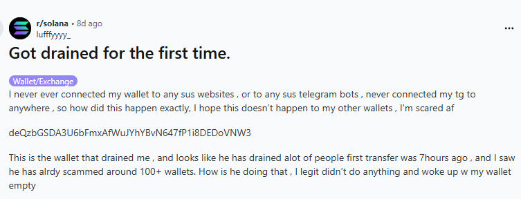
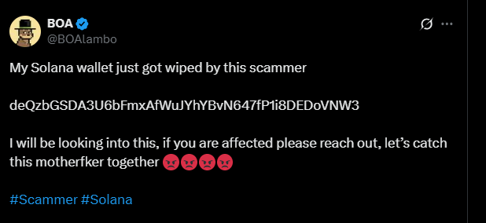
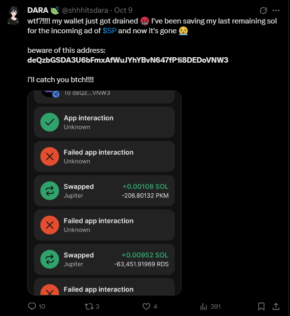
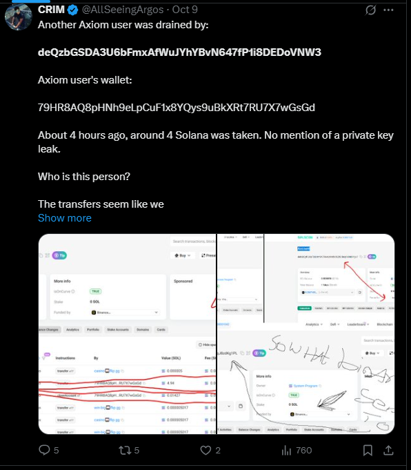
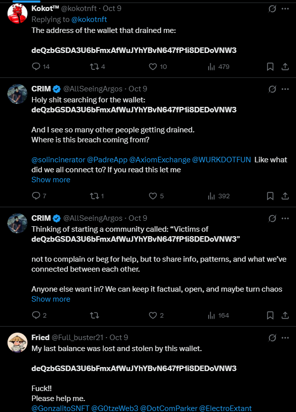
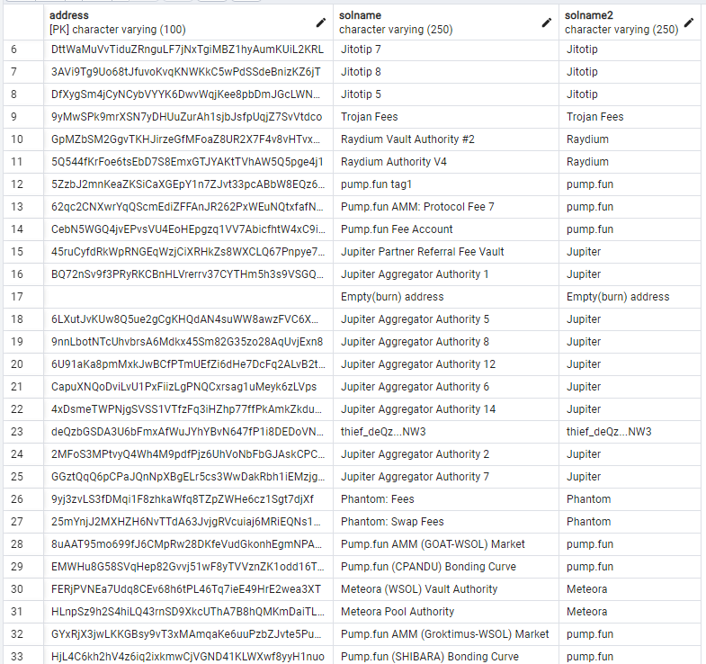
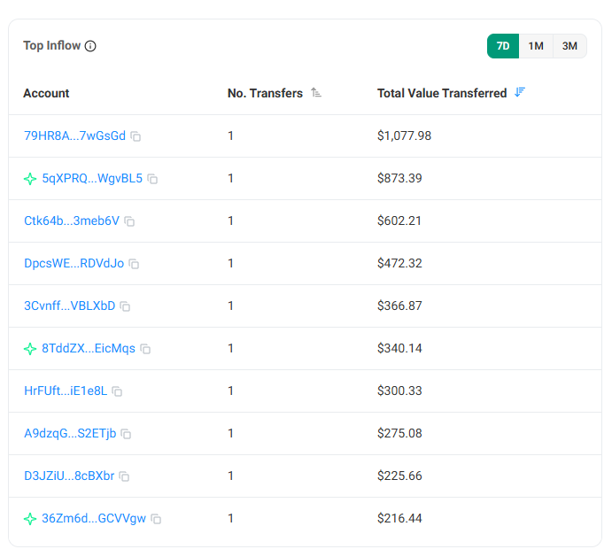
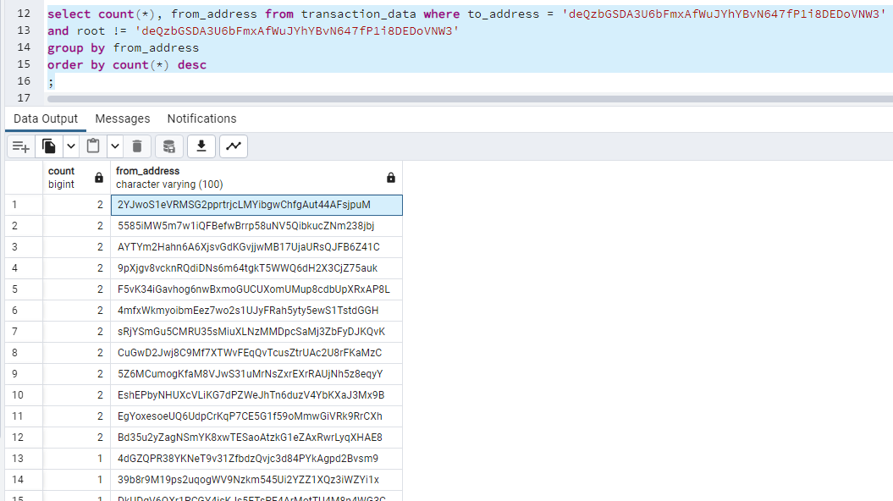
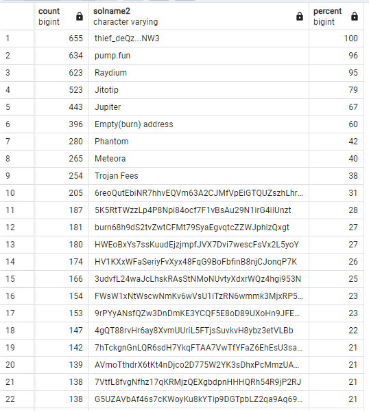
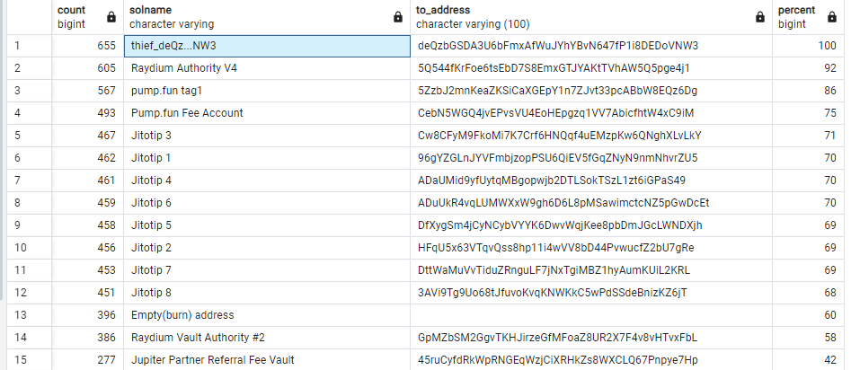

# Crypto Report #0135 Solana Wallets Drained: Over 650 Accounts Hit in Single-Day Attack (October 9, 2025)

## Keywords
crypto theft, solana, pump.fun, raydium, `deQzbGSDA3U6bFmxAfWuJYhYBvN647fP1i8DEDoVNW3`

## Abstract
On October 9, 2025 657 wallets were fully drained and all SOL coins were transferred to `deQzbGSDA3U6bFmxAfWuJYhYBvN647fP1i8DEDoVNW3`







## The material of investigation
* [Solana explorer](https://solscan.io/)
* Downloaded and uploaded into PostgreSQL the transaction history of 655 compromised wallets (3,782,452 transaction records in the table `transaction_data`)
* Manual table `address_solname` contains Solana public names of most used addresses by compromised wallets

* The full backup of the analytics PostgreSQL database can be downloaded [here](https://drive.google.com/file/d/1PP2_p3BYkCfnQovo4thrbRlkZnSlVfvd/view?usp=sharing) for your own investigation

## Analytics
### Stats
* 657 Solana wallets were drained from Oct 09, 2025 00:00  till Oct 09, 2025 17:40 (17 hours attack)
* Only SOL coins were drained and transferred to the Solana wallet [deQzbGSDA3U6bFmxAfWuJYhYBvN647fP1i8DEDoVNW3](https://solscan.io/account/deQzbGSDA3U6bFmxAfWuJYhYBvN647fP1i8DEDoVNW3)
* 669 drain transfers (some wallets were drained twice)
* Total amount of stolen coins 97.05 SOL (around $20,000)
* Average amount per compromised walllet is 33$, the max is #1,077.98

  
### The attack was planned and started at midnight, the scenario of the attack is the same: 
* calling closeAccount function  to return all available rent SOL to the main victim wallet
* drain all SOL coins and transfer them to a malicious wallet `deQzbGSDA3U6bFmxAfWuJYhYBvN647fP1i8DEDoVNW3`
* remained SOL amount to <1$ on compromised accounts
* 12 of 657 accounts where drained twice to drain remained SOL coins
```sql
select count(*), from_address from transaction_data where to_address = 'deQzbGSDA3U6bFmxAfWuJYhYBvN647fP1i8DEDoVNW3' and root != 'deQzbGSDA3U6bFmxAfWuJYhYBvN647fP1i8DEDoVNW3' group by from_address order by count(*) desc
```


### pump.fun smart contracts
* 96% of all the compromised sent money to [pump.fun](https://pump.fun) smart contracts in their history, 94% to [Raydium DEX Wallet](https://raydium.io/)
```sql
select COUNT(*), solname2, (100*COUNT(*)/655) as Percent
from 
	(
		select distinct 
			root, 
			from_address, 
			COALESCE((select solname2 from address_solname where address = to_address limit 1), to_address) as solname2, 
			action, 
			flow 
		from transaction_data
	)s
where flow = 'out' and root <> 'deQzbGSDA3U6bFmxAfWuJYhYBvN647fP1i8DEDoVNW3'
group by solname2, flow
having count(*) > 1
order by count(*) desc
``` 


* The most used addresses:
  * 92% compromised wallets sent coins to `comp5Q544fKrFoe6tsEbD7S8EmxGTJYAKtTVhAW5Q5pge4j1` (*Raydium Authority V4*)
  * 86% to `5ZzbJ2mnKeaZKSiCaXGEpY1n7ZJvt33pcABbW8EQz6Dg` (*pump.fun tag1*)
```sql
select COUNT(*), solname, to_address, (100*COUNT(*)/655) as Percent
from 
	(
		select distinct 
			root, 
			from_address, 
			COALESCE((select solname from address_solname where address = to_address limit 1), to_address) as solname, 
			to_address,
			action, 
			flow 
		from transaction_data
	)s
where flow = 'out' and root <> 'deQzbGSDA3U6bFmxAfWuJYhYBvN647fP1i8DEDoVNW3'
group by solname, to_address, flow
having count(*) > 1
order by count(*) desc
```


## Conclusions
* Private keys of victim wallets were compromised, there are direct transfers from wallet to wallet without any DeFi
* The private keys could be compromised on [pump.fun](https://pump.fun) or [Raydium DEX](https://raydium.io/)
* *The best idea is to move tokens from compromised wallets.*
* Check if your Solana wallet was compromised. Here the full list of victims. [Compromised wallets](compromised_wallets.txt)

*The investigation is still underway...*

*any help or information from your side will be highly appreciated, just contact [https://x.com/cryptokarl013](https://x.com/cryptokarl013)*

> [Other investigations by @cryptokarl013](https://cryptokarl013.github.io/)

